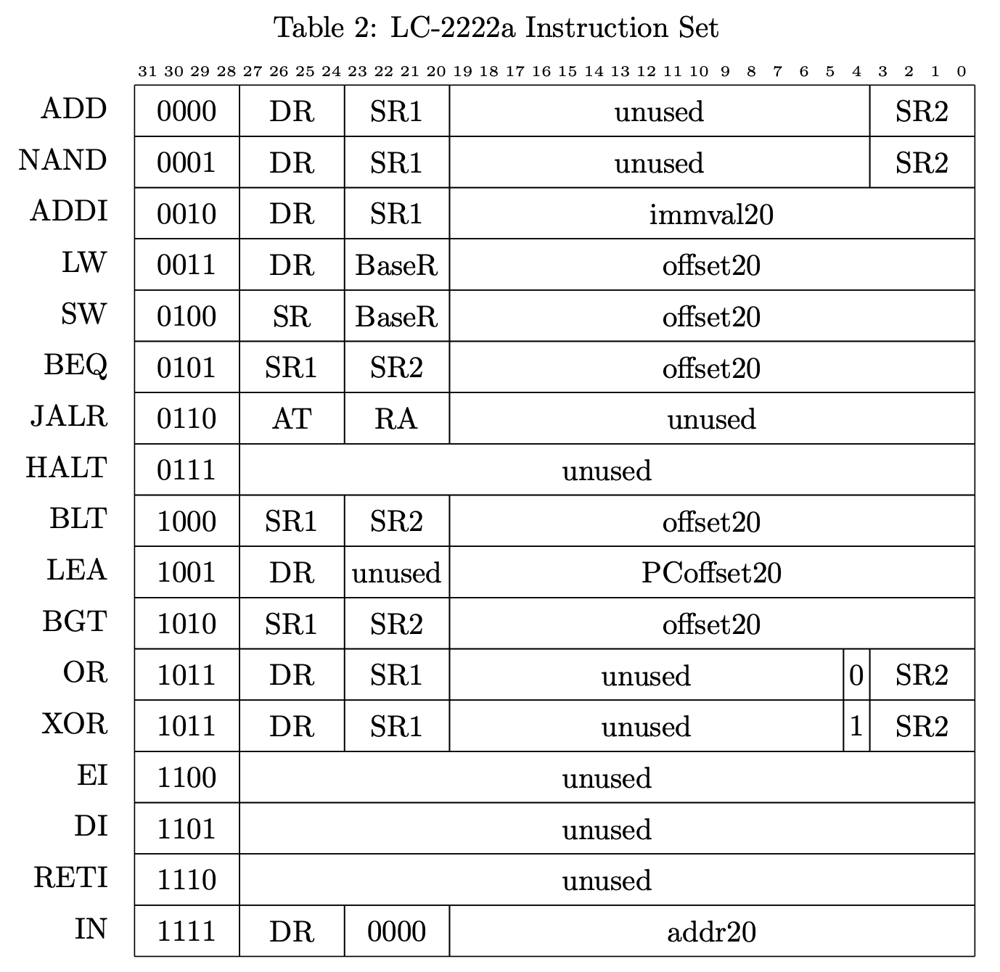
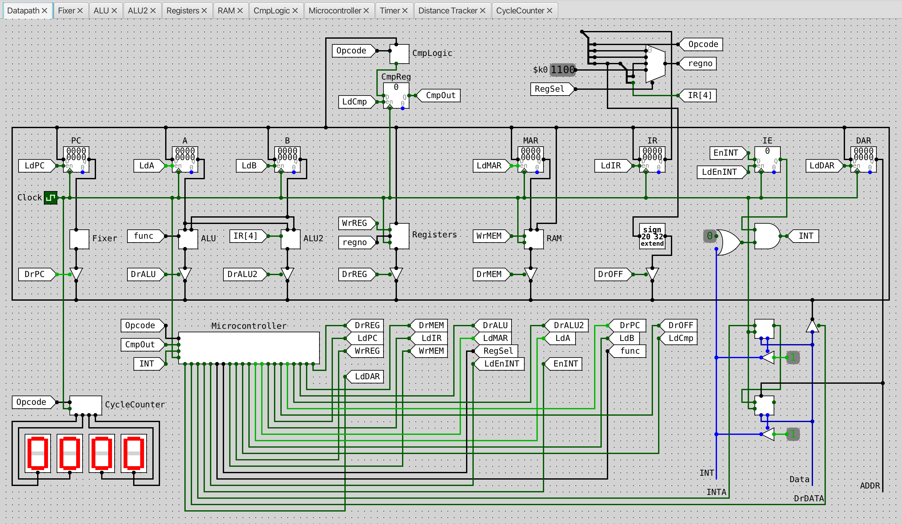
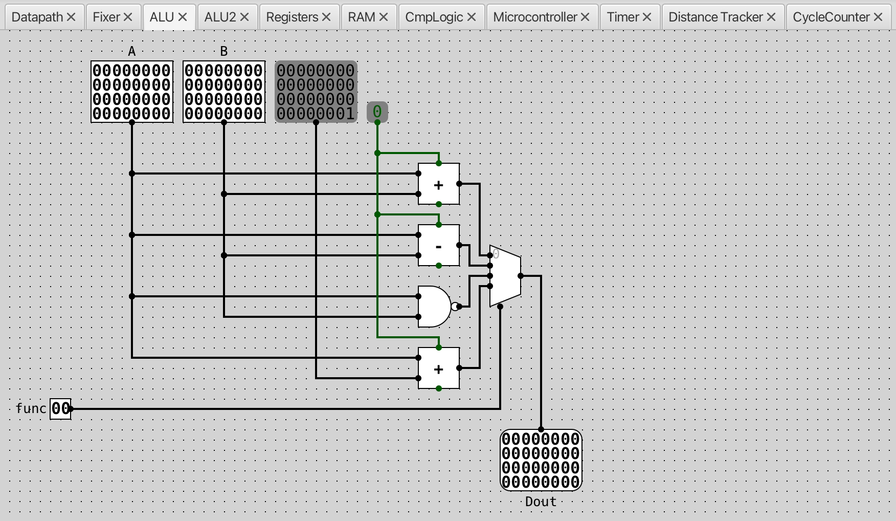
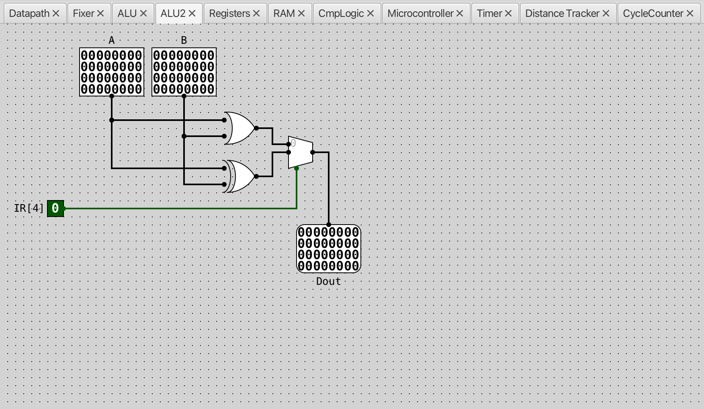
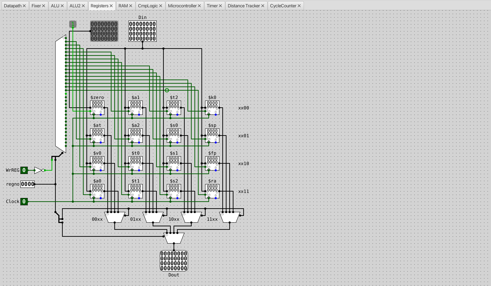
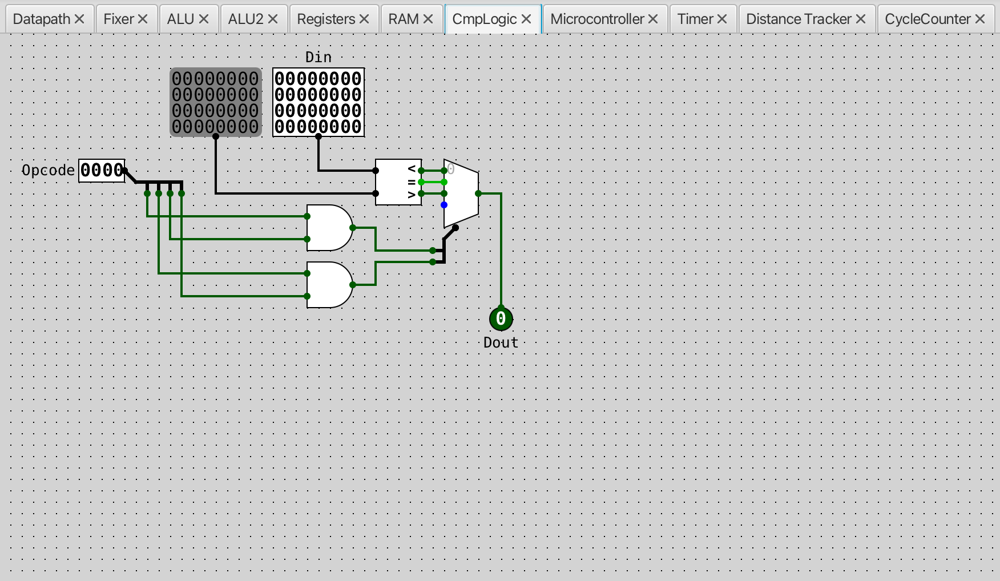
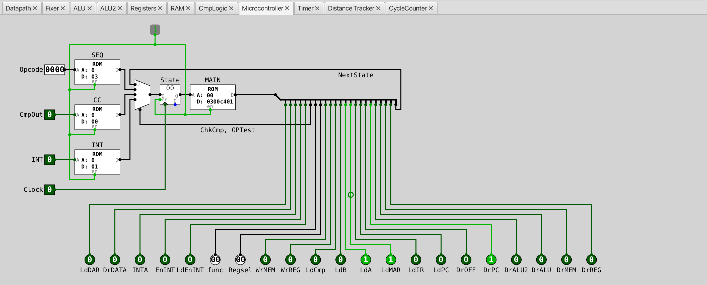
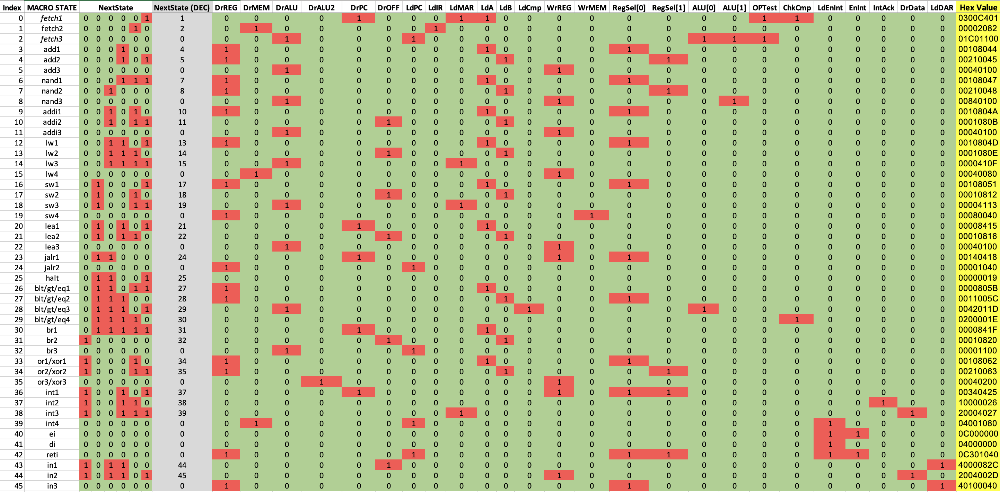

## Requirements

### CircuitSim

We use [CircuitSim](https://ra4king.github.io/CircuitSim/) version `1.9.1` to 
inplement the datapath and simulate the assembly. For Windows user, go to 
[CircuitSim/Windows/](https://www.roiatalla.com/public/CircuitSim/Windows/) to 
download and install the `.exe` file.
For MacOS, the installation is a little bit tricky. First, download the Jar file
from [CircuitSim/Jar/](https://www.roiatalla.com/public/CircuitSim/Jar/). 
CircuitSim requires Java 14+. Additionally, not all versions of the JDK come 
with JavaFX which CircuitSim uses. 
-   If you have never installed Java 14 or higher before, simply install the 
    latest JDK that already comes with JavaFX, i.e., 
    [Azul Zulu](https://www.azul.com/downloads/?os=macos&package=jdk-fx#downloads-table-zulu).
    To open CircuitSim,
    ```shell
    java -jar "CircuitSim1.9.1.jar"
    ```
-   If you already have a recent Java version installed, download the JavaFX SDK
    separately from [Gluon JavaFX](https://gluonhq.com/products/javafx/) that 
    matches your Java version. To open CircuitSim,
    ```shell
    java -jar --module-path "javafx-sdk-21.0.4/lib" --add-modules javafx.base,javafx.controls,javafx.fxml "CircuitSim1.9.1.jar"
    ```
Note that you need to replace `javafx-sdk-21.0.4` and `CircuitSim1.9.1.jar`
with the correct path to the JavaFX SDK and the CircuitSim jar. Then, click 
File -> Load to check our [datapath.sim](datapath.sim) file.

### Assembly

The LC-2222 assembler is written in Python. If you do not have Python 2.6 or 
newer installed on your system, you will need to install it before you continue.

## Insturction

The instructions we implemented are summarized below.



-   `ADD: DR = SR1 + SR2;` The `ADD` instruction obtains the first source 
    operand from the `SR1` register. The second source operand is obtained from 
    the `SR2` register. The second operand is added to the first source operand, 
    and the result is stored in `DR`.
-   `NAND: DR = ~(SR1 & SR2);` The `NAND` instruction performs a logical `NAND`
    on the source operands obtained from `SR1` and `SR2`. The result is stored 
    in `DR`.
-   `ADDI: DR = SR1 + SEXT(immval20);` The `ADDI` instruction obtains the first 
    source operand from the `SR1` register. The second source operand is 
    obtained by sign-extending the immval20 field to 32 bits. The resulting 
    operand is added to the first source operand, and the result is stored in 
    `DR`.
-   `LW: DR = MEM[BaseR + SEXT(offset20)];` An address is computed by 
    sign-extending bits [19:0] to 32 bits and then adding this result to the 
    contents of the register specified by bits [23:20]. The 32-bit word at this 
    address is loaded into `DR`.
-   `SW: MEM[BaseR + SEXT(offset20)] = SR;` An address is computed by 
    sign-extending bits [19:0] to 32 bits and then adding this result to the 
    contents of the register specified by bits [23:20]. The 32-bit word obtained
    from register `SR` is then stored at this address.
-   `BEQ: if (SR1 == SR2) {PC = incrementedPC + SEXT(offset20)}` A branch is 
    taken if `SR1` is equal to `SR2`. If this is the case, the 
    `PC` will be set to the sum of the 
    incremented `PC` (since we have already 
    undergone fetch) and the sign-extended offset[19:0].
-   `JALR: RA = PC; PC = AT;` First, the incremented 
    `PC` (address of the instruction + 1) is stored into register `RA`. Next, 
    the `PC` is loaded with the value of register `AT`, and the computer resumes 
    execution at the new `PC`.
-   `HALT` The machine is brought to a halt and executes no further 
    instructions.
-   `BLT: if (SR1 < SR2) {PC = incrementedPC + SEXT(offset20)}` A branch is 
    taken if `SR1` is less than `SR2`. If this is the case, the 
    `PC` will be set to the sum of the 
    incremented `PC` (since we have already undergone fetch) and the 
    sign-extended offset[19:0].
-   `LEA: DR = PC + SEXT(PCoffset20);` An address is computed by sign-extending 
    bits [19:0] to 32 bits and adding this result to the incremented 
    `PC`
    (address of instruction + 1). It then stores the computed address into 
    register `DR`.
-   `BGT: if (SR1 > SR2) {PC = incrementedPC + SEXT(offset20)}` A branch is 
    taken if `SR1` is greater than `SR2`. If this is the case, the 
    `PC` will be set to the sum of the 
    incremented `PC` (since we have already undergone fetch) and the 
    sign-extended offset[19:0].
-   `OR: DR = SR1 | SR2;` The `OR` instruction obtains the first source operand 
    from the `SR1` register. The second source operand is obtained from the 
    `SR2` register. Preform the `OR` operation on the two operands, and the 
    result is stored in `DR`.
-   `XOR: DR = SR1 (XOR) SR2;` The `XOR` instruction obtains the first source 
    operand from the `SR1` register. The second source operand is obtained from 
    the `SR2` register. Preform the `XOR` operation on the two operands, and the
    result is stored in `DR`.
-   `EI: IE = 1;` The Interrupts Enabled `IE` register in 
    [`Datapath`](assets/00-Datapath.png) is set to `1`, enabling interrupts.
-   `DI: IE = 0;` The Interrupts Enabled `IE` register in 
    [`Datapath`](assets/00-Datapath.png) is set to `0`, disabling interrupts.
-   `RETI: PC = $k0; IE = 1;` The `PC` is 
    restored to the return address stored in `$k0` register in 
    [`Register`](assets/04-Registers.png). The Interrupts Enabled `IE` register 
    in [`Datapath`](assets/00-Datapath.png) is set to `1`, enabling interrupts.
-   `IN: DAR = SEXT(addr20); DR = DeviceData; DAR = 0;` The value in addr20 is 
    sign-extended to determine the 32-bit device address. This address is then 
    loaded into the Device Address Register `DAR` register in 
    [`Datapath`](assets/00-Datapath.png). The processor then reads a single word 
    value off the device data bus, and writes this value to the `DR` register. 
    The `DAR` is then reset to zero, ending the device bus cycle.


## Datapath

A simpler datapth without supporting interrupts can be find
[here](assets/datapath.png) that you can see the overall structure and use it 
to deduce behavior of each instruction.



## ALU

We have two ALUs with 2-bit and 1-bit control signal respectively. The 2-bit 
[`ALU`](assets/02-ALU.png) can perform `00: ADD`, `01: SUB`, `10: NAND`, 
`11: A+1` operations, control by signal `func`. The 1-bit 
[`ALU2`](assets/03-ALU2.png) can perform `0: OR`, `1: XOR` operations, control 
by signal `IR[4]`, i.e., the fifth bit of instruction (refer to `OR` and `XOR` 
[instruction](#insturction) details). As a notes, we use the term 'operation'
for ALU, and it's different from the term 'instruction' that we use for the ISA.
The control gate `DrALU` in [`Datapath`](assets/00-Datapath.png) will be set if 
we want [`ALU`](assets/02-ALU.png) output and `DrALU2` will be set if we want 
[`ALU2`](assets/03-ALU2.png) output.




## Registers

The LC-2222a has 16 general-purpose registers:

| Register Number | Name  | Use                         | Callee Save? |
|-----------------|-------|-----------------------------|--------------|
| 0               | $zero | Always Zero                 | NA           |
| 1               | $at   | Assembler/Target Address    | NA           |
| 2               | $v0   | Return Value                | No           |
| 3               | $a0   | Argument 1                  | No           |
| 4               | $a1   | Argument 2                  | No           |
| 5               | $a2   | Argument 3                  | No           |
| 6               | $t0   | Temporary Variable          | No           |
| 7               | $t1   | Temporary Variable          | No           |
| 8               | $t2   | Temporary Variable          | No           |
| 9               | $s0   | Saved Register              | Yes          |
| 10              | $s1   | Saved Register              | Yes          |
| 11              | $s2   | Saved Register              | Yes          |
| 12              | $k0   | Reserved for OS and Traps   | NA           |
| 13              | $sp   | Stack Pointer               | No           |
| 14              | $fp   | Frame Pointer               | Yes          |
| 15              | $ra   | Return Address              | No           |

-   **Register 0** is always read as zero. Any values written to it are 
    discarded. 
-   **Register 1** is used to hold the target address of a jump. It may also be 
    used by pseudo-instructions generated by the assembler.
-   **Register 2** is where you should store any returned value from a 
    subroutine call.
-   **Register 3-5** are used to store function/subroutine arguments. 
-   **Register6-8** are designated for temporary variables. The caller must 
    save these registers if they want these values to be retained.
-   **Register 9-11** are saved registers. The caller may assume that these 
    registers are never tampered with by the subroutine. If the subroutine needs 
    these registers, then it should place them on the stack and restore them 
    before they jump back to the caller.
-   **Register 12** is reserved for handling interrupts. While it should be 
    implemented, it otherwise will not have any special use on this assignment.
-   **Register 13** is the everchanging top of the stack; it keeps track of the 
    top of the activation record for a subroutine.
-   **Register 14** is the anchor point of the activation frame. It is used to 
    point to the first address on the activation record for the currently 
    executing process.
-   **Register 15** is used to store the address a subroutine should return to 
    when it is finished executing.

At implementation level, [`Registers`](assets/04-Registers.png) has a 32-bit 
input data `Din`, a 32-bit output data `Dout`, and three control signals: 
`WrREG`, `regno`, `Clock`. Since we only have 16 registers, we use a 4-bit 
`regno` to select which register to read or write.

-   **Write Register.** When write data into a register, set `WrREG` to `1` and 
    `regno` to the register that we want to write to. Note that in 
    our design we use a decode with 5-bit select signal where the first 4 bits 
    are the `regno` and the last bit is not of `WrREG` and . When `WrREG` is 
    `0`, Decoder will always select `[16-19]`, i.e., no register will be 
    enabled to write. When `WrREG` is `1`, Decoder will select by the 
    `regno` value.
-   **Read Register.** We use two levels of Mux with 2-bit select signal two 
    select which register to read. The first level Mux selects using `regno[0-1]`
    and the second level Mux selects using `regno[2-3]`. The control gate 
    `DrREG` in [`Datapath`](assets/00-Datapath.png) will be used to control 
    whether to output the register data to bus or not.



## Comparison Logic

The [`CmpLogic`](assets/06-CmpLogic.png) is responsible for performing the 
comparison logic associated with the `BLT`, `BGT`, and `BEQ` instructions. 
When executing `BLT`, `BGT`, and `BEQ`, A - B will be computed using `01: SUB` 
operation of the 2-bit [`ALU`](assets/02-ALU.png). While this result of the ALU 
is being driven on the bus, the comparison logic will read the result and output
a single `true` or `false` bit for either the condition `A > B`, `A < B`, or 
`A == B`, depending on the instruction being executed that control by the signal
`func`. The control gate `LdCmp` in [`Datapath`](assets/00-Datapath.png) will be 
set so that bool output of the comparison logic will be temporarily stored in 
the register `CmpReg` in [`Datapath`](assets/00-Datapath.png). This bool 
register will be used in next cycle for `CC` ROM in 
[`Microcontroller`](assets/07-Microcontroller.png) to decide whether to jump or 
not.



## Microcontrol Unit

This microcontrol unit can be implemented in different ways, such as using 
combinational logic and flip-flops or a single ROM to hardwire the signals. 
However, using a single ROM can be highly inefficient, as it would waste a 
significant amount of space. This is because most microstates do not depend on 
the opcode or conditional tests to determine which signals to assert. For 
instance, if the condition line is an input for the address, every microstate 
would require an address for both condition = 0 and condition = 1, even though 
this only matters for one specific microstate.

To address this inefficiency, a four-ROM microcontroller can be utilized, which 
also handles interrupts. In this design, four ROMs are used:

-   Main `MAIN` ROM: Outputs control signals.
-   Sequencer `SEQ` ROM: Helps determine which microstate to transition to at 
    the end of the `FETCH` state.
-   Condition `CC` ROM: Assists in deciding whether to skip an instruction 
    during `BLT` (Branch Less Than) operations.
-   Interrupt `INT` ROM: Determines whether the next state is fetch2 or the 
    start of the `INT` macrostate.

In this arrangement, the next state can originate from four different sources: 
part of the output from the previous state (`MAIN` ROM), `SEQ` ROM, `CC` ROM, or
`INT` ROM. A multiplexer (MUX) controls which of these sources is passed through
to the state register. If the "next state" field from the previous state 
dictates where to go, neither the `OPTest` nor `ChkCmp` signals are asserted. 
If the `Opcode` from the instruction register `IR` determines the next state 
(such as at the end of the `FETCH` state), the `OPTest` signal is asserted. 
If the comparison circuitry decides the next state (as in a `BLT` instruction), 
the `ChkCmp` signal is asserted. When dealing with an interrupt (entering the 
`INT` macrostate), both the `OPTest` and `ChkCmp` signals are asserted. 

A simpler microcontrol unit can be find
[here](assets/microcontrol.png) that you can see the overall structure and use 
it to deduce behavior of each instruction.




## Acknowledgements

I would like to thank 
[Hanyun (Hannah) Huang](https://www.linkedin.com/in/hanyun-huang/) for her 
invaluable help in understanding the many details of this project. Her support 
and clarity were crucial in guiding me through the process.

## References

-   Project 1 - LC-2222 Datapath, *CS2200 Introduction to Systems and Networking* 
    by Prof. Daniel Forsyth, 
    [Georgia Institute of Technology](https://www.gatech.edu).
-   Project 2 - Interrupts, *CS2200 Introduction to Systems and Networking* 
    by Prof. Daniel Forsyth, 
    [Georgia Institute of Technology](https://www.gatech.edu).
-   *Computer Systems: An Integrated Approach to Architecture and Operating Systems*
    by Umakishore Ramachandran and William D. Leahy.
